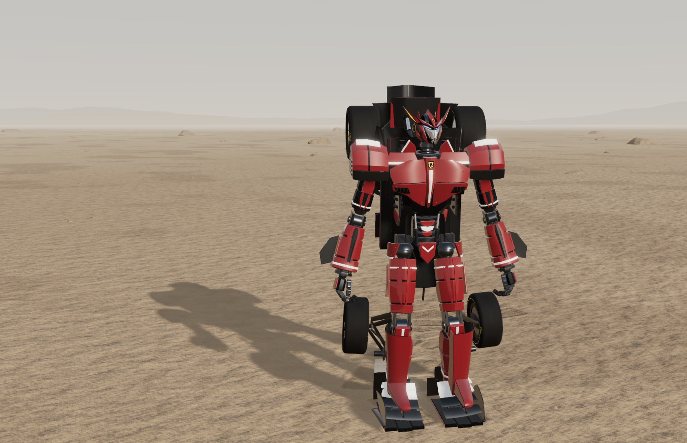

# Transformers

Somewhere out in an endless desert, a stainless-steel truck is parked in the sun. You press a key, and it wakes up.

The windows drop into the doors. The mirrors fold in. The tonneau cover Z-folds back, the doors and fender pods step out on their carriers, and the hood squares up and slides along what's about to be a shin. Then the whole machine rises like a drawbridge, pivoting on its planted feet with lift thrusters firing off its back plate, until a robot is standing where the truck used to be. Every panel it wore as a car, it's still wearing.

That's the idea behind this project. It isn't a car that turns into a robot. It's a robot that has been lying on its back all along, folded up inside a car.

## The rule: nothing is faked

We didn't allow ourselves the usual shortcuts, so there's no flash of light covering a model swap, no parts spawning out of nowhere, and no panel ghosting through another one. Every plate is carried by something at every frame of the transformation. The hood really does become the shin armour, the door becomes the thigh, and the tailgate folds up into the chest. If you pause at any moment you'll see a machine partway through a real mechanical sequence.

The robots were designed first, as robots, and the car was worked back around them afterward. So they don't look like a sedan wearing a costume. Their shells are faceted, segmented, layered and bolted, and the heads get the finest detail of all.

## The roster

**The Cybertruck.** It's brutal and angular, and as a car it matches the real proportions: 5.68 metres of flat stainless planes. As a robot it's a walking slab of armour, with a light bar for toes and the windshield split down the middle so each leg keeps its own wiper.

**The Ferrari F1.** This one is a Formula 1 car in Scuderia red, an entirely different kind of machine. It's low, lean, and packed tight with struts and carriers that unfold its bodywork into something much taller than you'd expect.

Each one has its own voice, and the sounds are meant to feel like real recordings of heavy machinery: servos, hydraulics, metal settling under load. They aren't cartoon clanks.

## The desert

The world goes on forever, with ridges on the horizon, rock outcrops, and a low sun throwing long shadows. The sand answers back. Tyres cut ruts with a real tread pattern and a lip of displaced sand along each edge. Robot feet leave sole-shaped footprints. Wheelspin, landings and jet blasts kick up dust that billows and drifts. Minutes later the wind has smoothed your tracks away.

## Built for the browser

All of this runs in a web page. It's rendered with WebGPU and three.js, and it's tuned so that it looks as close to real as we can manage while running smoothly the whole time. The screen stays clean too. The HUD is small, and the machines are what you're here to look at.

Drive, stop, transform, walk, jump, and look back at the tracks you've left.
