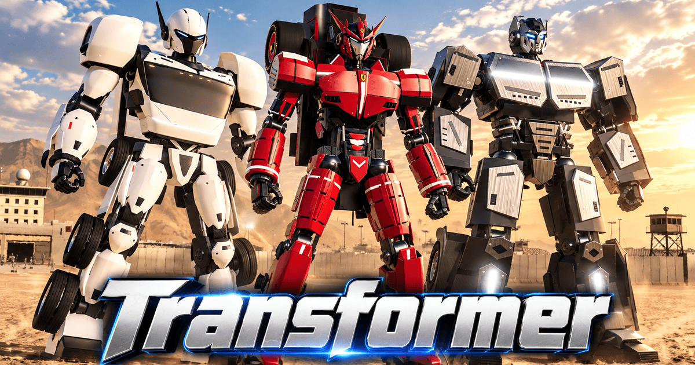

# Transformers

The truck has been parked in the same spot since morning. Its steel panels are too hot to touch, and the only sound is the wind pushing sand over the ridge behind it.

Then the windows slide down into the doors.

The mirrors tuck in flat. The cover over the bed folds back on itself, once and then again. The doors and wheel arches lift away from the body on arms that weren't there a moment ago. The hood slides forward and settles along something that is starting to look like a shin. Thrusters light up along the back, and the whole truck tips upright, slowly, pivoting over a pair of feet that were planted in the sand the entire time.

The thing standing there is still wearing the truck. The doors are its thighs and the tailgate is folded into its chest. The windshield has split down the middle, and each leg has kept its own wiper.

## How they were made

Each of these machines began as a robot. The robot was drawn first, at full height, and only afterward folded down with a car built around it. That's why none of them look like vehicles in costume.

It's also why the change has nothing to hide. There's no flash of light to cover a swap, no panel sliding through another, and nothing appears from nowhere. Pause at any moment and you'll find each plate partway along its path, held by the hinge or arm that is moving it.

## Three of them

**The Cybertruck** is the one from the opening. As a truck it's flat, blunt and a little absurd. Standing up, all those hard angles finally make sense as armour. Its toes are the light bar.

**The Ferrari** is a Formula 1 car in racing red. It's so low and narrow that there doesn't seem to be room inside it for anything. Then the struts open, and the bodywork keeps unfolding well past the height you'd have guessed.

**The Semi** rolls in with a white trailer behind it and ends up the tallest thing in the desert. It kneels up out of its own cab. The nose of the truck becomes its chest, and the doors swing round to guard its forearms. Behind it, the trailer lowers itself onto its own legs, uncouples, rolls back and collapses in on itself until it's small enough to lock onto the robot's back. The Semi fights with its feet first. When that isn't enough, it has a gun that is two weapons at once, a machine gun and a coil cannon.

Each of them has its own voice. You hear servos working under load, hydraulics taking the weight, and metal ticking as it settles. It sounds more like a machine shop than a cartoon.

## The desert

It has no edge. Ridges run along the horizon, rocks break through the sand here and there, and the sun sits low enough that everything throws a long shadow.

The sand keeps a record of you. Tyres press their tread into it and push up a small bank on either side. Feet leave the shape of their soles. Spin the wheels, land a jump or fire the thrusters, and dust lifts off the ground and drifts away. Come back a few minutes later and the wind will have smoothed most of it over.

## Playing

It runs in a browser tab. Drive for a while, then stop somewhere and stand up. Walk around and jump. Before you go, turn and look at the marks you've left, while the wind is still working on them.

## License

This project is licensed under the GNU General Public License v3.0 (GPL-3.0-only).

You may use, modify, and redistribute this software under the terms of the GPLv3. If you distribute a modified or derivative version of this project, you must also make the corresponding source code available under the GPLv3.

See the [LICENSE](./LICENSE) file for the full license terms.
